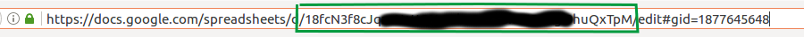
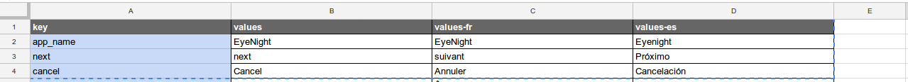

# Drive2Android-Gradle
Drive2Android is a gradle plugin that allows to import and export the strings directly from Google Drive to an Android project.
This plugin support many languages.

Setup
==========
In the gradle of your application (app/build.gradle), add the followings line at the top of the file:


```gradle
buildscript {
    repositories {
        jcenter()
    }

    dependencies {
        classpath 'com.geronimostudios.drive2android:drive2android:0.2'
    }
}

apply plugin: "com.geronimostudios.drive2android"
```

Then create a credentials on the Google Developers Console, please follow the step 1 of this tutorial :
https://developers.google.com/drive/v3/web/quickstart/java#step_1_turn_on_the_api_name

Once you have your *client_secret.json*, add the followings line somewhere in your app gradle:

```gradle
drive2android {
    fileId = 'PUT_YOUR_GOOGLE_DRIVE_FILE_ID_HERE'
    clientSecret = '/client_secret.json'
    resPath = '/src/main/res'
    stringFileName = 'strings.xml'
}
```

**fileId**: you can get the file Id in your spreadsheet's URL.


**clientSecret** is the path to your client_secret.json.

**resPath** is the path to your res folder. This value is optional and may not be changed.

**stringFileName** is the name of the file that will be searched in every folder (that starts with **values**) located under **resPath**. This value is optional and may not be changed.

Your Google spreadsheet must be formatted like this:

The first column's header must contains the value 'key'. Then each header contains the name of the folder under wich the strings will be added.
Ex: the strings under the header 'values' will be imported into values/strings.xml

How to use
==========
```bash
./gradlew importStrings
./gradlew exportStrings
```

**importStrings** Takes all strings from google drive and override the local ones. 

**exportStrings** Export the strings that are not already on Google Drive (the new ones only).

You can also use 
```bash
./gradlew import
./gradlew export
```

Coming soon
==========
**stringFileName** will support an array of filename.
